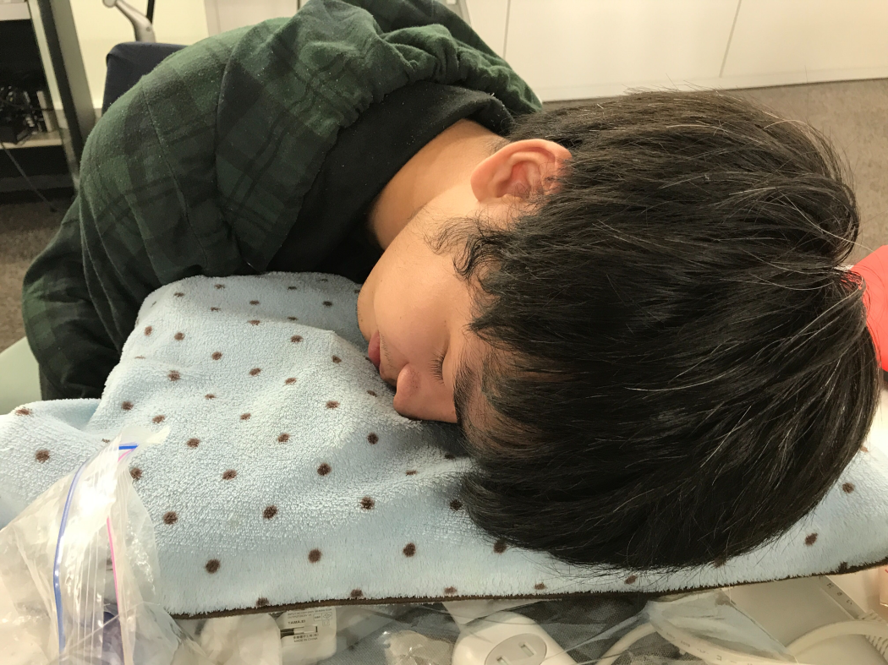

# Come-in-まくら

## 製品概要

### 仮眠 X Tech

### 背景（製品開発のきっかけ、課題等）
メンバーの一人に、
お昼寝の時に目覚ましタイマーを設定せずに寝落ちしてしまう。
そして夜までそのまま起きることができない。
という問題に悩む人がいました。
どうすればこの問題を解決することができるのか。

原因を考えた結果、
時計を探して時間を設定することが面倒に感じてそのまま寝落ちしてしまう、
つまり、
目覚まし時計が勝手に設定されれば起きることができるのではないか！！
という発想に至りました。

### 製品説明（具体的な製品の説明）
仮眠用の枕。
枕を使うだけで目覚ましのタイマーを設定することができる。なので、アプリを起動したり、時計を探して時間を設定したりしなくてもすぐに眠りにつくことができます。

### 特長

#### 1. 特長1
枕に頭をおくだけでタイマーが自動的に起動します。わざわざケータイを開いたり、目覚まし時計を探したりしてタイマーを設定する必要はありません！！

#### 2. 特長2
寝てからどれくらいの時間で起こしてほしいかをスマホから自由に変更できます。
<!--また、Googleカレンダーと連携し、もし睡眠後に予定がある場合に予定よりもユーザーが設定した時間分前にタイマーの設定時刻を変更します。-->

#### 3. 特長3
初期設定と枕を使うこと以外でユーザーがしなければいけないことはありません！

### 解決出来ること
「少しだけ寝よう」と仮眠をとった際にそのまま寝過ごしてしまうことがなくなります！

### 今後の展望
<!--今回は実現できなかったが、今後改善すること、どのように展開していくことが可能かについて記載をしてください。-->
Googleカレンダーと連携して、予定があった場合はその予定の少し前にタイマーが設定されるようにする予定です。
予定によって起こされたときは、どんな予定があるかのプッシュ通知を飛ばします。また、タイマーが鳴った際に枕がGoogleアシスタントのように次の予定を話して教えてくれる機能も考えています。
これにより枕を秘書としても活用することができ、より一層快適に仮眠をとることができるようになります。

## 開発内容・開発技術
### 活用した技術
#### API・データ
<!--今回スポンサーから提供されたAPI、製品などの外部技術があれば記述をして下さい。-->

* 
* 
* 

#### フレームワーク・ライブラリ・モジュール
* Python
* flask
* pySerial
* Swift
* Arduino IDE

#### デバイス
* 枕
* Arduino
* 押しボタン
* 圧電スピーカー
* Raspberry Pi
* (iPhone)

### 独自開発技術（Hack Dayで開発したもの）
#### 2日間に開発した独自の機能・技術
<!-- * 独自で開発したものの内容をこちらに記載してください
* 特に力を入れた部分をファイルリンク、またはcommit_idを記載してください（任意） -->
* 寝たことを検知・起こす部分をブレッドボードで配線しました。
* ラズパイとarduinoを接続してラズパイ側に通信・処理を集中させるようにしました。
